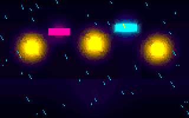
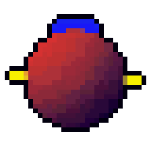
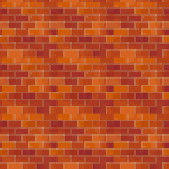

# pixel-builder

**A pixelizer for AI agents.** Give it a realistic image (file, URL, or a text prompt) and get back **true pixel art** at 8, 16, 32 or 64-bit era limits. It runs as an MCP server and a CLI, so any agent can drive it and look at the result.



## The guarantee

Every output is true pixel art, and `validate` checks it:

- one solid colour per pixel (no blur, no sub-pixel anti-aliasing)
- alpha is only 0 or 255
- colour count is within the era limit
- any upscale is integer nearest-neighbour

## Eras

| Era | Native width | Max colours | Palette rule |
|---|---|---|---|
| 8 | 160 | 24 | greedy pick from the NES palette |
| 16 | 320 | 48 | RGB555 (15-bit) snapped |
| 32 | 480 | 128 | free (k-means in OKLab) |
| 64 | 720 | 256 | free (k-means in OKLab) |

`size` overrides the native width.

## Presets, bloom, dither, outline

Presets grade colour in OKLCH before quantising: `vivid` (default), `neon`, `pastel`, `warm`, `cool`, `sepia`, `neutral`.
`bloom` (`off|low|med|high`) glows bright lights in linear light; `dither` (`off|low|med`) adds calm-area Bayer dithering; `outline` adds a 1px dark outline.
Run the `presets` tool for the full list with example calls.

## Modes

- `scene` (default): the whole image at era width.
- `sprite`: cut-out subject on transparent background, exact size (default 32 px); the background is keyed out (`bg=#rrggbb` to force it).
- `tile`: seamless tile plus a 3x3 tiling-check sheet.

 

## Effects

`effects=[rain,snow,shimmer,flicker,bloom_pulse]` (with `frames` 2-64 and `fps`) also writes a looping `-fx.gif`, a `-fx-sheet.png` spritesheet and `-fx-frames.json`. Every frame stays on the palette.

## Looks

A look locks era + palette + settings so a whole project matches: `looks action=save name=arcade from=pixel-out/x.json`, then `pixelize ... look=arcade`.

## Palette cohesion

Every `pixelize` quantises independently, so two images in one era can share almost nothing — measured, 1 of 48 colours on unrelated inputs, which makes a game look like several games. Each result reports `palette_budget`:

| field | meaning |
|---|---|
| `colours` / `limit` | distinct colours used vs the era ceiling |
| `overlap` | share of this image's colours that already exist in the output dir |
| `cohesion` | `solo` (first asset) · `tight` (>=70%) · `partial` (>=30%) · `drifting` (<30%) |
| `hint` | what to do next, or empty |

On `drifting`, save the strongest result as a look and pass `look=<name>` to the rest.

## Prompt path

`pixelize prompt="a rainy neon alley"` generates the source with an OpenAI-compatible images API. Env vars: `IMAGE_API_KEY` (required), `IMAGE_BASE_URL`, `IMAGE_MODEL`, `IMAGE_API_STYLE=chat` (OpenRouter-style chat endpoints). The generated source is saved next to the result as `-source.png`.

## Tools (MCP tools = CLI commands)

`pixelize`, `looks`, `presets`, `validate`.

## Quick start

```bash
npm install
npx tsx src/agent/cli.ts presets --json
npx tsx src/agent/cli.ts pixelize photo.jpg --era 16 --preset neon --bloom med --json
npx tsx src/agent/cli.ts validate pixel-out/photo-scene-16bit.png --max-colours 48
npx tsx src/agent/cli.ts mcp                     # MCP over stdio
npx tsx src/agent/cli.ts mcp --http --port 8788  # Streamable HTTP on 127.0.0.1
```

Output goes to `./pixel-out` (or `--out-dir`, or `PIXEL_BUILDER_OUT`): `<name>.png` (native, use in games), `<name>@Nx.png` (preview), `<name>.json` (meta + palette).

### MCP config

Claude Code (project `.mcp.json`, or `claude mcp add --transport stdio pixel-builder -- npx tsx <ABS>/src/agent/cli.ts mcp`):

```json
{ "mcpServers": { "pixel-builder": { "type": "stdio", "command": "npx", "args": ["tsx", "<ABS>/src/agent/cli.ts", "mcp"] } } }
```

Qwen Code (`~/.qwen/settings.json`) and Cline (`cline_mcp_settings.json`) use the same `mcpServers` shape without `type`; Hermes uses `~/.hermes/config.yaml`:

```yaml
mcp_servers:
  pixel_builder:
    command: "npx"
    args: ["tsx", "<ABS>/src/agent/cli.ts", "mcp"]
    env: { PIXEL_BUILDER_OUT: "<GAME>/pixel-out" }
```

Details and verification status: [docs/integrations.md](docs/integrations.md). Agent skill: `skills/pixel-builder/SKILL.md`; docs for LLMs: `llms.txt`.

## Troubleshooting

- **stdio protocol errors**: don't launch with plain `npm run mcp` (npm prints a banner to stdout); use `npx tsx ...` or `npm run -s mcp`.
- **`npx`/`node` not found in a GUI client**: put the absolute path of the binary in `command`.
- **`validate` fails on a preview**: pass `scale` (e.g. `--scale 4`), or validate the native PNG.
- **Too muddy or noisy**: change one thing at a time: `era`, then `preset`, then `dither`; try `size`.
- **Prompt path errors**: check `IMAGE_API_KEY`, `IMAGE_BASE_URL`, `IMAGE_MODEL`.
- **Look not found**: looks live in `<out_dir>/looks` (or `$PIXEL_LOOKS_DIR`); use the same `out_dir`.

## Development

`npm test`, `npx tsc`, `npm run build:node`, `npx tsx bench/run.ts` (eval on 8 synthetic images, writes `bench/RESULTS.md`). See `AGENTS.md`. The v1 generator app is archived on branch `archive/v1-generators`.
